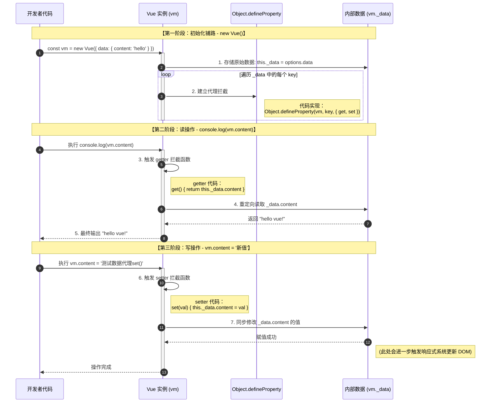

```mermaid
sequenceDiagram
    autonumber
    participant Dev as 开发者代码
    participant VM as Vue 实例 (vm)
    participant Define as Object.defineProperty
    participant Data as 内部数据 (vm._data)

    Note over Dev, Data: 【第一阶段：初始化铺路 - new Vue()】

    Dev->>VM: const vm = new Vue({ data: { content: 'hello' } })
    activate VM
    VM->>Data: 1. 存储原始数据: this._data = options.data

    loop 遍历 _data 中的每个 key
        VM->>Define: 2. 建立代理拦截
        Note right of Define: 代码实现：<br/>Object.defineProperty(vm, key, { get, set })
    end
    deactivate VM

    Note over Dev, Data: 【第二阶段：读操作 - console.log(vm.content)】

    Dev->>VM: 执行 console.log(vm.content)
    activate VM
    VM->>VM: 3. 触发 getter 拦截函数
    Note right of VM: getter 代码：<br/>get() { return this._data.content }
    VM->>Data: 4. 重定向读取 _data.content
    Data-->>VM: 返回 "hello vue!"
    VM-->>Dev: 5. 最终输出 "hello vue!"
    deactivate VM

    Note over Dev, Data: 【第三阶段：写操作 - vm.content = '新值'】

    Dev->>VM: 执行 vm.content = '测试数据代理set()'
    activate VM
    VM->>VM: 6. 触发 setter 拦截函数
    Note right of VM: setter 代码：<br/>set(val) { this._data.content = val }
    VM->>Data: 7. 同步修改 _data.content 的值
    Data-->>VM: 赋值成功
    Note right of Data: (此处会进一步触发响应式系统更新 DOM)
    VM-->>Dev: 操作完成
    deactivate VM
```
